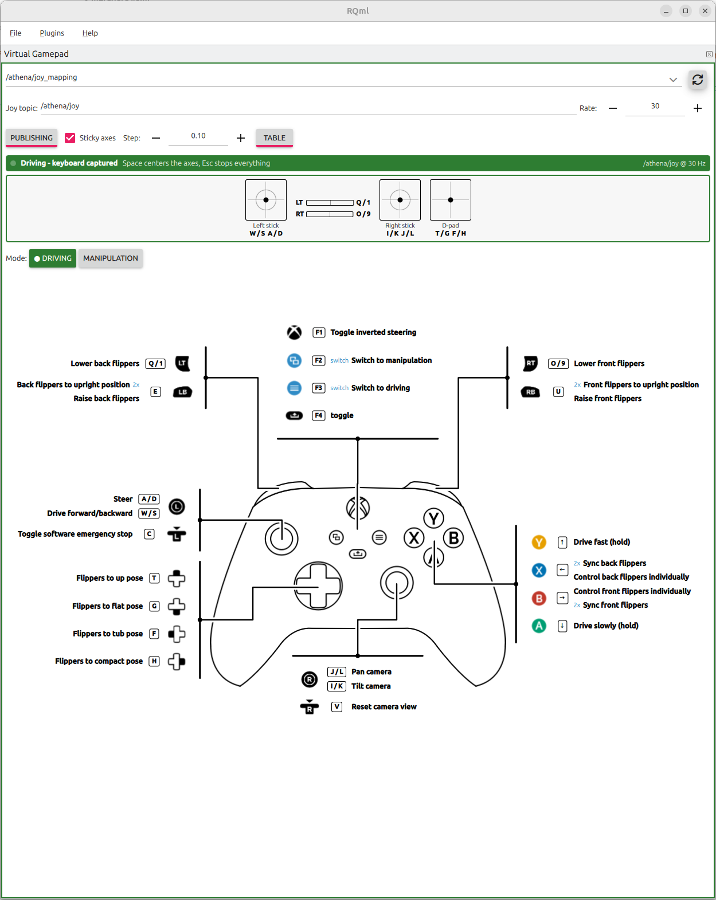

# hector_gamepad_manager_rqml_plugins

RQml plugins for the `hector_gamepad_manager`.

## Virtual Gamepad

*Control → Virtual Gamepad*

Drives a gamepad manager from the keyboard when no gamepad is at hand, and shows what the active
config binds each control to. It publishes `sensor_msgs/Joy` exactly as a real joy driver would -
same axis order, same sign conventions, same trigger encoding - so the manager, its plugins and
config switching all behave as usual.

<!-- Screenshot: the panel driving a robot: green banner, a mapping selected, the mode chips showing
     the active config, and the bindings table with a pressed control highlighted. -->


### Quick start

1. Pick the robot by its `joy_mapping` topic. With a single robot on the graph it is selected for
   you.
2. Click anywhere in the panel to give it the keyboard. The banner turns green.
3. Drive. `Space` centers the axes, `Esc` releases everything.

A fresh panel opens publishing. The play/pause button starts and stops the stream, sending one
neutral message when it stops. The settings button opens the joy topic, the publish rate and the
axis behaviour.

**Sticky axes** (the default) make the sticks and triggers behave like a throttle: a key press
moves the axis by one step and it stays there, and holding the key ramps it. Switch it off in the
settings for momentary behaviour: held is fully deflected, released is centered. The pads and bars
show the live axis values, with the manager's deadzone marked so you can see where an axis starts
counting as a pressed virtual button.


### What the banner says

The banner's colour shows the state. Each state names the first thing standing between a key press
and the robot, and the one action that clears it:

| Colour | State | What it means |
|---|---|---|
| Grey | Not publishing | Press play to start the stream. |
| Red | No valid joy topic | Publishing is on but nothing goes out. Check the joy topic in the settings. |
| Amber | Keyboard not captured | The stream runs, the keys go elsewhere. Click the panel. |
| Blue | Typing in a text field | The field has the keys. `Enter` or a click below the toolbar. |
| Green | Driving | Key presses reach the robot. |

Keys are read while any element of the panel holds the focus, the text fields excepted. Losing the
keyboard to another dock widget or another window releases every input, so a deflected stick
cannot be left behind.

### Views

The **Table / Diagram** switch sits at the end of the mode row.

**Table** (the default) lists every binding of the active config: key, control, action. Rows are
keyed off the canonical input `name` in the mapping, not its index. Controls the keyboard cannot
reach still get a row, marked `-`, and a clipped name or description can be read in full by
hovering it.

**Diagram** is a labelled controller schematic. Each control carries its keyboard key as a keycap
beside the glyph, and the control being pressed is tinted green. It needs a large panel: while its
callouts do not fit, the table is shown instead. It draws the layout even with no mapping selected,
which makes it a quick way to check that key presses are getting through.

**Mode chips** are one per config, the active one filled green and marked `●`. They are both the
indicator of what the robot is in and the control that changes it, so the two cannot disagree - a
switch made on a real gamepad moves the chips too. Clicking one presses that config's reserved
switch button and waits for the manager to republish the profile as the acknowledgement.
Any mode switch, whether from a chip, its key or a real gamepad, centers the sticks and triggers,
so a deflection held in one mode never drives the next.

### Notes

- **Publishing through the satellite.** The joy topic is derived from the mapping topic (`<ns>/joy`)
  and goes straight to the robot, which is the usual "at my desk without a joystick" case. Set it by
  hand in the settings to the operator station's local `joy` topic to publish through the
  `joy_satellite` instead; a hand-edit pins it, so selecting another robot will not steer it back.
- **The panel is a second publisher on the joy topic.** If a real gamepad is driving the same robot,
  stop publishing rather than letting the two streams interleave.
- **Picking another robot stops the stream**, so the robot being left gets its neutral message.
- `joy_mapping` and `joy_teleop_profile` are latched, so the bindings appear regardless of start
  order.
- Button glyphs are by Zacksly (CC BY 3.0) - see `qml/svgs/ATTRIBUTION.md`.

## Tests

`VirtualGamepadState.qml` (state and `Joy` conversion), `ProfileSwitcher.qml` (the config-switch
handshake) and `CaptureState.qml` (whether a key press reaches the robot) import nothing but
QtQuick, so they are unit-tested directly without ROS mocks:

```bash
colcon test --packages-select hector_gamepad_manager_rqml_plugins
```
